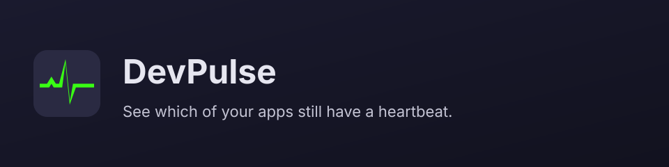
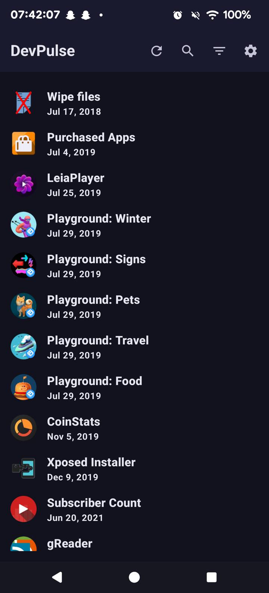

<!-- GENERATED by scripts/generate-project-readme.py — edit branding/product.json -->

  

<h1 align="center">DevPulse</h1>

<strong>See which of your apps still have a heartbeat.</strong>

  
  
  
  
  
  

  

## Pitch

DevPulse is a local-only Android app that checks whether the software you already installed still has a heartbeat. It scans Google Play, F-Droid official, F-Droid Archive, IzzyOnDroid, Guardian Project, CalyxOS F-Droid repo, opt-in Aptoide, and GitHub (discover by app name; listed only if the package appears on that repo's releases), then surfaces apps that look stale so you can find a living replacement, another sideload source, or a repo worth forking.

## Demo

  

  

  

## Features

- Scans Google Play, F-Droid official, F-Droid Archive, IzzyOnDroid, Guardian Project, CalyxOS F-Droid repo, opt-in Aptoide, and GitHub (by app name; listed only if the package appears on that repo's releases)
- Honest ✅ available / ❌ missing / ❓ unknown marks per source, plus an On GitHub filter
- HTML, CSV, and XML export of the current list
- Completely local: no accounts, analytics, or telemetry
- Distributed from GitHub Releases as a FOSS APK

## Quick start

1. Download the latest APK from GitHub Releases (https://github.com/edwardlthompson/DevPulse/releases) and sideload it on Android 8 or later.
2. Grant the installed-apps permission when asked, then run a scan. Aptoide is opt-in in Settings; GitHub rows appear only when the package is on that repo's releases.
3. Building from source: JDK 17+ and the Android SDK, then cd examples/android && ./gradlew test assembleDebug.

## For humans

Start with this README, then [`CONTRIBUTING.md`](CONTRIBUTING.md) and [`docs/BEST_PRACTICES.md`](docs/BEST_PRACTICES.md). The first-month playbook is [`docs/FIRST_30_DAYS.md`](docs/FIRST_30_DAYS.md).

## For agents

Read [`docs/START_HERE.md`](docs/START_HERE.md) and [`AGENTS.md`](AGENTS.md). In Cursor type `/tour` or `/bootstrap`. Any other IDE: ask the agent to read [`docs/help/TOUR.md`](docs/help/TOUR.md). `/coach` is the next recommended action.

## Install

Sideload the latest APK from GitHub Releases: https://github.com/edwardlthompson/DevPulse/releases. Android 8 or later (minSdk 26). Building from source needs JDK 17+ and the Android SDK; the app lives in examples/android/. applicationId is app.devpulse.

## Usage

Open DevPulse, scan installed apps, then sort or filter the list (including On GitHub). Export the current list as HTML, CSV, or XML when you want a snapshot. Staleness marks are not a security audit. Maintainers: edit colors in design-tokens/design-tokens.json and logos in branding/assets/, then run python3 scripts/sync-design-tokens.py.

## Configuration

Copy [`.env.example`](.env.example) to `.env` for local secrets (never commit `.env`). Stack-specific config lives in the active `examples/` or app root after prune.

## Contributing

See [`CONTRIBUTING.md`](CONTRIBUTING.md). Prefer small PRs; follow Conventional Commits and the BUILD_PLAN labels (`AGENT` / `HUMAN` / `ADB` / `AUTO`). Status markers: 🔲 open · ✅ done · ❌ blocked.

## Security

See [`SECURITY.md`](SECURITY.md). Enable Dependabot alerts and follow [`docs/SECURITY_TRIAGE.md`](docs/SECURITY_TRIAGE.md) for weekly CVE triage.

## License

[GPL-3.0-or-later](LICENSE) — see the license file for terms.

## Acknowledgments

Scaffolded with [agent-project-bootstrap](https://github.com/edwardlthompson/agent-project-bootstrap). Brand assets: [`branding/BRANDING.md`](branding/BRANDING.md). Design system: [`docs/DESIGN_GUIDE.md`](docs/DESIGN_GUIDE.md).
