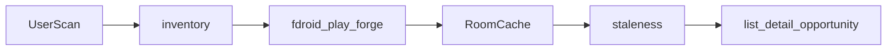

# Product Specification

> DevPulse product spec from the child-repo pastes. Feature slices still use `docs/features/{name}.md`.
> Status markers: 🔲 open · ✅ done · ❌ blocked.

## Overview

**Product:** DevPulse
**applicationId:** `app.devpulse` (documented now; Gradle Golden Path id stays until Sprint 1)
**Purpose:** Scan installed Android apps across Google Play, F-Droid official index plus user-added extra repos including IzzyOnDroid, and public forges (GitHub, optionally GitLab and Codeberg). Surface software that is stale or no longer in development. Users find living replacements, alternative sideload locations, and public repos. The author also uses it to decide the next app to build or fork.
**Users:** Primary is the author. Secondary is everyone else seeking replacements. Operators are FOSS contributors. There is no backend.
**Stack:** Android only. Kotlin, Jetpack Compose, Material 3 / Material You. No Google Play Services, Firebase, or closed telemetry.
**Distribution:** Pure FOSS via GitHub Releases only. DevPulse will not be listed on F-Droid. The app still *reads* official F-Droid and extra-repo indexes to score other installed apps. Reproducible builds with `SOURCE_DATE_EPOCH`.
**License:** GPL-3.0-or-later (init used MIT; Sprint 0 replaced it).
**Tone:** Quiet, trustworthy pulse-check. Not another noisy updater.

## Stakeholders

- **Primary:** the author, who uses DevPulse to decide which app to develop or fork next.
- **Secondary:** everyone else, who finds replacements for apps that are stale or beginning to break, plus alternative sideload locations and public repos.
- **Operators / maintainers:** FOSS contributors and the F-Droid build server. No backend to operate.

## Goals

- Give a truthful, source-attributed staleness picture for every user-installed app, with an optional system-app toggle.
- Show whether a public repo exists and how recently it moved.
- Surface opportunity (what to build next) and alternatives (what to install instead).
- Stay private, FOSS, and understandable. Keep the production path free of proprietary SDKs even though we ship only on GitHub.

## Non-goals

- Not a silent updater by default. The user triggers each install. Root `pm install` is silent only when the user picks that method and `su` is granted. Session can skip the confirm dialog on Android 12+ only when updating an app DevPulse already installed (`UPDATE_PACKAGES_WITHOUT_USER_ACTION`). Play has no FOSS file URL.
- Not a Play Store client, paid-app license checker, or Play review scraper.
- No accounts, cloud sync, or social features.
- No proprietary SDKs, crash reporters, or ads.
- No exploit of private Play or GitHub APIs. Public pages, official F-Droid indexes, and documented forge APIs only.
- Do not attack, scrape-hammer, or bypass rate limits. Back off, cache, and degrade.
- Do not claim an app is malware or safe. Staleness is not a security audit.

## Success (qualitative)

- A first-run user can scan, understand badges, and open a detail page in one sitting.
- The author can open Opportunity and see category gaps among their stale, actually-used apps.
- A replacement-seeker can tap a stale app and see living F-Droid or IzzyOnDroid alternatives plus known download locations.
- A GitHub Release APK is installable as a sideload, with About and an F-Droid-safe update-check stub.

## Functional Requirements & User Stories

### Inventory

| ID | Story | Acceptance |
|----|-------|------------|
| FR-1 | As a user I list installed apps via PackageManager | User apps listed; optional settings toggle includes system apps |
| FR-2 | As a user I see identity and install facts | Icon, label, package, installed version, `lastUpdateTime`, minSdk, targetSdk |
| FR-3 | As a user I see origin | Flag: Play, F-Droid, extra repo, or sideloaded-unknown |
| FR-4 | As a user I understand QUERY_ALL_PACKAGES before any scan | In-app rationale on Android 11+; no scan until acknowledged |
| FR-5 | As a power user I optionally rank by real use | PACKAGE_USAGE_STATS walkthrough; never required |
### Lookups (on demand or during a user-started scan)

| ID | Story | Acceptance |
|----|-------|------------|
| FR-6 | As a user I see Play Updated-on and published version | Public HTML only; rate-limit; cache; 403 or parse fail → unknown-check-manually; never guess a date |
| FR-7 | As a user I match against official F-Droid | Signed index preferred; cache on disk; last-updated or last-added plus SourceCode |
| FR-8 | As a user I add extra F-Droid-compatible repos | IzzyOnDroid settings toggle; Guardian Project, Calyx, custom URLs |
| FR-9 | As a user I find a GitHub repo | Search package name and/or title; latest commit and release when found |
| FR-10 | As a user I optionally use GitLab and Codeberg | Same idea as GitHub |
| FR-11 | As a user I get extracted source links | From F-Droid SourceCode and Play description or developer website when present |
| FR-12 | As a user I paste a missed repo URL | DevPulse tracks it thereafter |
| FR-13 | As a user I optionally store a GitHub token | EncryptedSharedPreferences; never logged |
| FR-14 | As a user I see leftovers as unknown | Anything not found on those sources stays sideloaded or unknown |
### Staleness

| ID | Story | Acceptance |
|----|-------|------------|
| FR-15 | As a user I see days since last remote activity | Newest reliable remote among Play updated-on, F-Droid last-updated, forge commit or release. Installed `lastUpdateTime` is a separate field and must not paint green if remotes are dead |
| FR-16 | As a user I understand badges | Green under 180 days; amber 180–365; red over 365 or missing from all successful remotes. Failed lookup is unknown, not automatic red |
| FR-17 | As a user I see compatibility risk | Warning when targetSdk is more than 3 API levels behind stub targetSdk 37, even if a store date looks recent |
### UI

| ID | Story | Acceptance |
|----|-------|------------|
| FR-18 | As a user I run one full scan | One-tap; progress; pause and resume; Play and GitHub not hammered |
| FR-19 | As a user I scan a result list | Icon, name, package, installed version, badges, repo-found indicator |
| FR-20 | As a user I open detail | Exact dates per source, published vs installed version, deep links, days-since-activity, compatibility warning, notes |
| FR-21 | As a user I filter and sort | Age, source, has-public-repo, pinned, usage if granted |
| FR-22 | As a user I keep a loved stale app | Pin hides it from the red list; remains in data; Opportunity only if I ask |
| FR-23 | As a user I get Material You | System, light, dark; all copy in `strings.xml`; no raw string literals in composables |
| FR-24 | As a user I open About | Golden Path About: version, license, source, donations stub, F-Droid-safe update-check stub |
### Opportunity (later sprints)

| ID | Story | Acceptance |
|----|-------|------------|
| FR-25 | As the author I see What to build | Group stale apps by Play or F-Droid category; show quiet counts |
| FR-26 | As the author I keep a private Develop-next list | Fork-this list with private notes |
| FR-27 | As the author I export a focused report | Most-used stale titles plus category gaps as CSV and JSON |
| FR-28 | As the author I see DevPulse's own pulse | Configured package and repo; no search miss |
### Replacements (later sprints)

| ID | Story | Acceptance |
|----|-------|------------|
| FR-29 | As a user I see Alternatives | Cached F-Droid plus Izzy and other enabled repos by category, name similarity, tags; only maintained matches with dates and links |
| FR-30 | As a user I see Sources | Every known location; opt-in prefetch of direct APK URLs; user confirms install; never open a website to fetch a file we already have |
| FR-36 | As a user I keep a Play date after delisting | Wayback HTML `datePublished` only; never invent a date from the capture timestamp |
### Polish (later sprints)

| ID | Story | Acceptance |
|----|-------|------------|
| FR-31 | As a user I export the full scan | CSV and JSON |
| FR-32 | As a user I see scan history | Detect if something suddenly went quiet |
| FR-33 | As a user I opt into local notifications | 6 month or 1 year crossings; NotificationManager and WorkManager; no FCM |
| FR-34 | As a user I see a home widget | Count of stale red apps |
| FR-35 | As a maintainer I ship on GitHub | GitHub Release notes and optional Fastlane changelog; no F-Droid listing |
FR-25 through FR-35 are in product scope but not Sprint 0 or 1 implementation.

## Non-Functional Constraints

- FOSS isolation: grep Gradle and TOML only for proprietary SDKs such as Play Services and Firebase.
- Reproducible APK, `SOURCE_DATE_EPOCH`, wrapper and dependency versions pinned.
- Offline or degraded mode: cached indexes still show last-known data. Mark sources unknown rather than crashing.
- Rate limits: token bucket or spacing for Play pages and forge APIs. Persist backoff.
- Accessibility: content descriptions, contrast, large text, TalkBack on list, detail, and scan.
- minSdk 26 (do not lower). targetSdk 37 as the Golden Path stub allows.
- File budgets: 300 lines static data, 150 lines pure logic.
- Honest User-Agent: `DevPulse/0.1` plus the public GitHub URL. Do not impersonate a browser.

## Architecture & Data Flow

Clean / MVVM. Logic decoupled from Compose. Composition root stays tiny (`GoldenPathApp.kt` or successor gets at most about 10 extra lines per feature).

| Layer | Role |
|-------|------|
| inventory | PackageManager and usage-stats wrapper |
| index.fdroid | Download, verify if feasible, parse, query |
| index.play | Rate-limited public page parse |
| index.forge | GitHub, GitLab, Codeberg clients |
| staleness | Pure functions plus unit tests. This is the heart |
| alternatives | Similarity and category match against cached indexes |
| ui | List, detail, opportunity, settings, scan |
| export, widget, notify | Later slices |

User starts a scan. PackageManager builds inventory. F-Droid and extra-repo indexes plus Play page lookups plus forge lookups write a local cache. A staleness model reads the cache. List, detail, Opportunity, Alternatives, export, widget, and notifications all read that model.

### Golden Path locked API (Sprint 0/1)

Do not implement scanners yet. Lock these existing surfaces:

- Theme: `ThemeMode` (`System`, `Light`, `Dark`), `ThemeMode.next()`, `ThemePreferences`, `GoldenPathTheme`
- About: `ReleaseAsset`, `ReleaseAssetSelector.select`, `AppUpdatePreferences`, `CheckSchedule`, `DonationsLoader`, `UpdateStatusEvaluator`
- Navigation: About and Settings toggles in `GoldenPathApp` / `GoldenPathScreen`; `GoldenPathScaffold`; `NavigationModeProvider`

## Test-first rule

Every feature in `docs/plan.md` / BUILD_PLAN must list tests, or state why automation is not feasible and name the fallback command.
